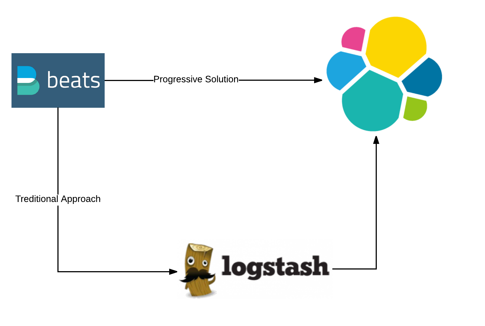
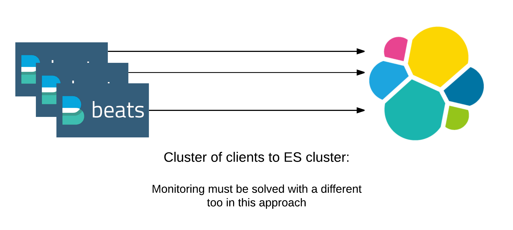

# elastic-stack-puppet-20164

This is a simple Elastic stack that uses a beat client with a fake log generator to configure a log stash elastic search puppet infrastructure within Digital Ocean.

The older approach with a **logstash forwarder => Logstash => elasticsearch** is essentially deprecated. 

The Elastic Stack   approach gives you the option to favor more work on the client and configure a beatfile that is configured and filtered to go directly to elastic search 0r **beats => elastic search** and skip logstash

This project is to get a basic clustered setup so support multiple logstash and elastic search services by creating puppet environments for logstash and elasticsearch. I have outlined the solution in the traditional elk stack:

The approach that will simplify the solution and move more of the load onto the client and potentially remove bottlenecks is the beats => elasticsearch solution this however has a specific use case and should not be used if you don't have a simple need. if you are doing complicated filtering or pipelining of your data you will need to keep log stash in your solution. 

 

The key for logging or searching solutions with ES is understanding the amount of Data that needs to be processed and configuring the architecture to manage enough through put, and redundancy so that you have a durable and searchable solution.
